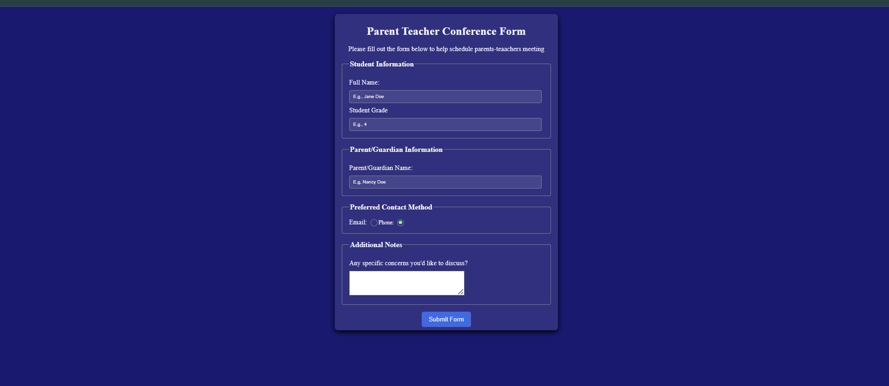

## Parent Teacher Conference Form

# Description
A simple form that allows users to enter student details as well as parents

## Technologies
- HTML5
- CSS3

## Features
- A well crafted background and Foreground that does not strain the user's eye
- Animated radio buttons with a smooth transition 

## Preview

## What I Learned

Through this project, I learned how to:

* Structure a form using semantic HTML elements.
* Style forms with CSS to create a clean and professional layout.
* Apply different CSS selectors to target specific elements.
* Customize the appearance of input fields, labels, textareas, and buttons.
* Use spacing properties such as `margin` and `padding` to improve readability.
* Control element sizing with `width`, `max-width`, and the CSS box model.
* Style borders, border radius, and backgrounds to enhance the user interface.
* Work with typography by changing font families, font sizes, and text alignment.
* Use pseudo-classes like `:focus` and `:hover` to improve user interaction and accessibility.
* Organize CSS code for better readability and maintainability.
* Build a responsive form that adapts to different screen sizes.
* Appreciate the importance of user-friendly form design and consistent styling.
